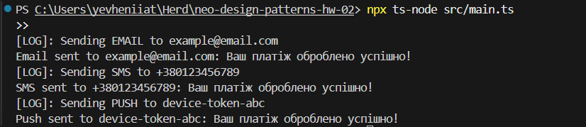

# SOLID Messaging System Refactor

Цей проєкт демонструє рефакторинг простої системи повідомлень з порушеннями SOLID-принципів до архітектури, яка:

* Дотримується принципу єдиної відповідальності (SRP)
* Відкритий для розширення і закритий для модифікації (OCP)
* Забезпечує підстановку Лісков (LSP)
* Розділяє інтерфейси для різних каналів (ISP)
* Інвертує залежності та використовує Dependency Injection (DIP)

## Структура проекту

```
/src
  /core
    interfaces.ts       # Інтерфейси для користувача, логера та каналів повідомлень
  /models
    User.ts             # Клас користувача, який отримує канали через DI
  /services
    Logger.ts           # Сервіс логування
    EmailNotification.ts# Клас відправки email
    SMSNotification.ts  # Клас відправки SMS
    PushNotification.ts # Клас відправки push-повідомлень
  main.ts               # Приклад використання системи
```

## Ініціалізація проєкту

1. Ініціалізуйте Node.js та TypeScript:

   ```bash
   npm init -y
   npm install --save-dev typescript ts-node @types/node
   ```

2. Створіть базовий tsconfig.json:

   ```bash
   npx tsc --init
   ```

## Встановлення та запуск

1. Встановіть залежності:

   ```bash
   npm install
   ```

2. Запустіть код без компіляції, використовуючи ts-node:

   ```bash
   npx ts-node src/main.ts
   ```

У результаті в консолі побачите логування та повідомлення про відправлені канали для тестового користувача.

---

### Очікуваний результат

- Усі канали повідомлень `Email`, `SMS`, `Push` мають бути окремими сервісами, які реалізують спільний інтерфейс.
- Клас `NotificationService` не повинен знати про конкретні реалізації каналів.
- `Logger` має бути переданим як залежність через інтерфейс.
- Клас `User` більше не викликає логіку повідомлень.
- У `main.ts` повинна бути наочно продемонстрована взаємодія з системою через абстракції.


